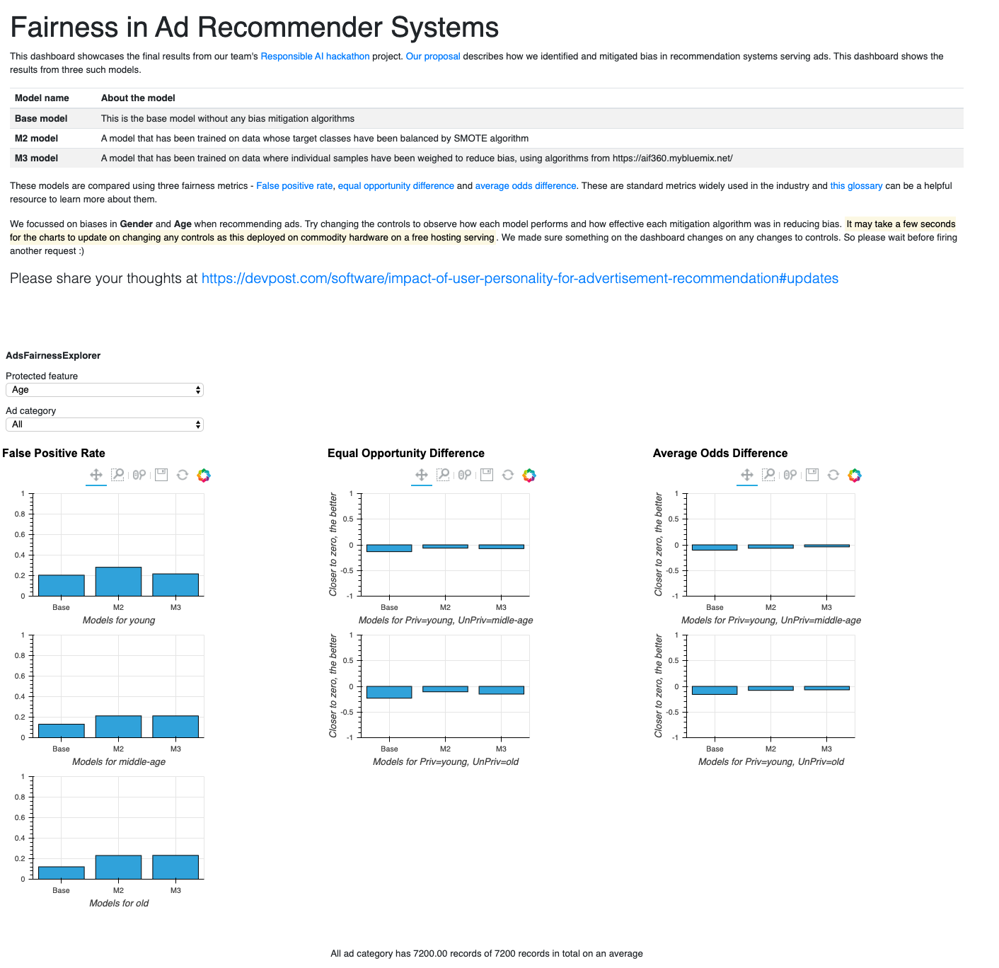

# Fairness in Recommender Systems - ads use case

This is the dashboard to showcase the final results from https://github.com/salilkanitkar/responsible_ai_hackathon/tree/master project which was created as part of [Responsible AI hackathon](http://responsible-ai.devpost.com/)

## Live Demo
Please visit https://bit.ly/ads-rec-fairness-dashboard to see the dashboard live. It may take a few seconds to load as it is running on a free hosting service with basic hardware.

**Credits:** The base bokeh deployment code was borrowed from https://github.com/jd12006/bokeh-demo