

                                                   
                          

Responsible AI Hackathon

Impact of user personality on
advertisement recommendations

Responsible AI Concerns
===============================================

Bias and discrimination in marketing advertisements are
something big firms and governments have been tackling for years. With
the advent of artificial intelligence and a gigantic amount of data
about customers (personal information, interactions, likes, dislikes )
and products,  we have machine learning algorithms and recommendation
systems to automate audience targeting, ad delivery, and ad engagement
predictions. But little did they know that bias in the data and opacity
of the models would land them into trouble for the same problem - BIAS &
DISCRIMINATION

❝

Women control 73 percent of consumer spending
in the United States and $20 trillion globally and yet ads frequently
fail to speak to them in a way that shows an understanding of their
lives.

❞

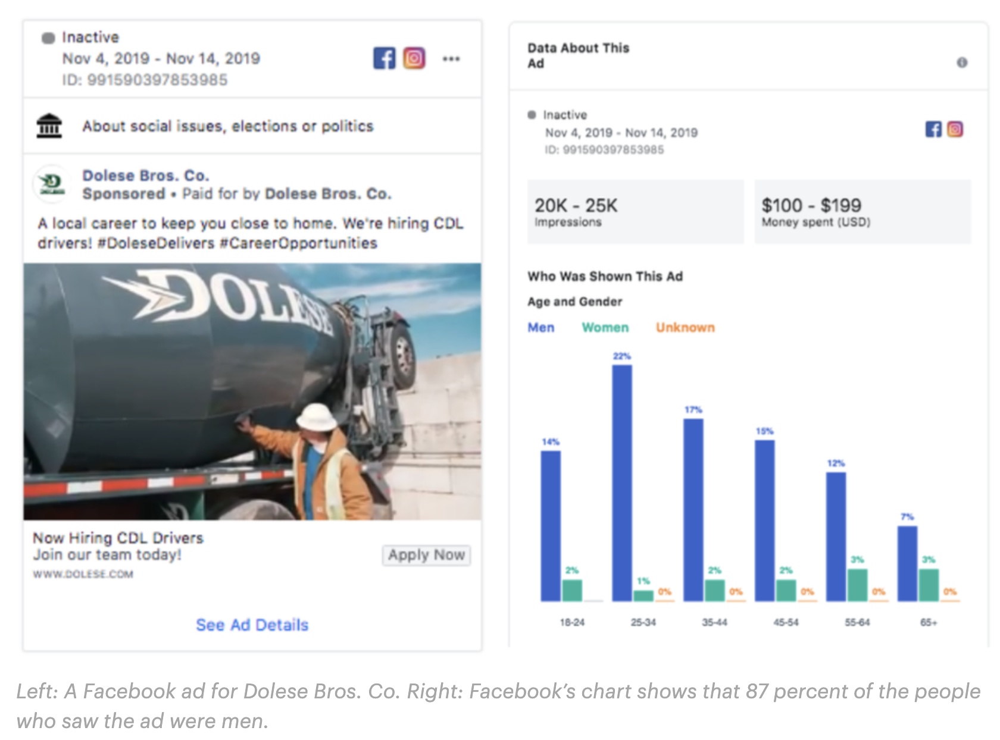

Based on our study on existing problems, we found the
following broad areas, each one being a research area of its own kind,
where the recommended advertisement can be deemed as biased or
discriminatory and not well accepted by society. 

Bias in Online ad delivery & audience
targeting

Big firms nowadays target their customers using click
prediction models and recommendation algorithms to drive their profits.
However, due to inherent bias in the data that has been collected over
the years, the delivery of ads can be biased.

<a href="https://www.google.com/url?q=https://www.theverge.com/2019/4/4/18295190/facebook-ad-delivery-housing-job-race-gender-bias-study-northeastern-upturn&amp;sa=D&amp;ust=1589252851987000" class="c15">https://www.theverge.com/2019/4/4/18295190/facebook-ad-delivery-housing-job-race-gender-bias-study-northeastern-upturn</a>

Advertisement not reaching everyone

Although it's prerogative of the companies to decide
the audience and target customers who deliver high profit, sometimes it
can kick in sense of discrimination across the customers who learn about
the product indirectly say by word of mouth. For example, beauty
products being excessively targeted for only white women.

Advertisements delivered to the right audience but
offending and harassing customers

Over relying on machine learning models might keep
recommending and targeting a certain section of the population without
taking into effect the perception and acceptance of the ads.

For example, advertisements for sports goods delivered
to the members of the black community without taking into account the
profession or interests of the person. On similar lines, we see ads
delivered to our mailboxes for some disease/ailments which one wouldn't
want to discuss.

Bias in the advertisement images

With all the above boxes checked correctly, we could
still have some possibility of bias or discrimination via images that
the ads contain.

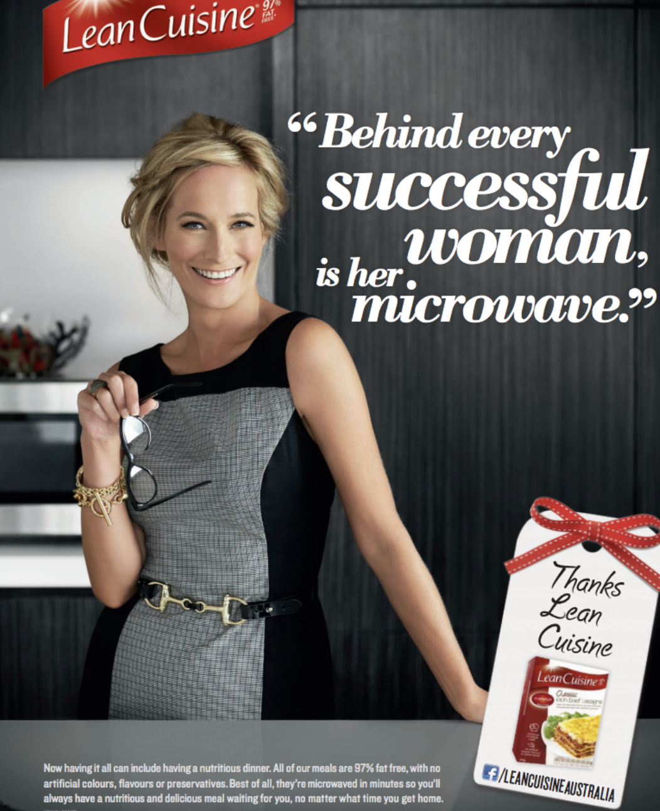

The image showing women showing success
linked to kitchen and microwave

Source - <a href="https://www.google.com/url?q=https://in.pinterest.com/kminseo63/bias-in-advertisements/&amp;sa=D&amp;ust=1589252851988000" class="c15">https://in.pinterest.com/kminseo63/bias-in-advertisements/</a>

The problem addressed and dataset
=========================================================

In this big world of online advertisements, there is
tons of research published in the field of machine learning bringing
profits for big firms, case studies on how well advertisements are being
accepted, and experiments linking psychology, politics with
advertisements.

We have picked one of the research studies linking user
personality with advertisements and setting a benchmark for ad rating
predictions and ad click predictions.

Choosing a Dataset
-----------------------------------------------

For the task of investigating and fixing fairness in an
Advertisement Recommendation system requires a dataset that is rich
across 3 different verticals:

1.  The dataset should contain information about the
    people being presented with the Ads
2.  The dataset should have Advertisements across
    multiple categories and types
3.  The dataset should capture users' reactions and/or
    preferences for the Ads shown.

With these constraints in mind, we have chosen to use the publicly
available ADS Dataset from research study: <a href="https://www.google.com/url?q=https://www.kaggle.com/groffo/ads16-dataset&amp;sa=D&amp;ust=1589252851990000" class="c15">https://www.kaggle.com/groffo/ads16-dataset</a> (Research
paper <a href="https://www.google.com/url?q=http://ceur-ws.org/Vol-1680/paper3.pdf&amp;sa=D&amp;ust=1589252851990000" class="c15">here</a>)

This research uses a personality perspective to
determine the unique associations among the consumer's buying tendency
and advert recommendations.

Why this Dataset?
----------------------------------------------

Personality-based Ads recommender systems are
increasingly attracting the attention of researchers and industry
practitioners. Personality is the latent construct that accounts for
“individuals characteristic patterns of thought, emotion, and
behavior.

Attitudes, perceptions, and motivations are not
directly apparent from clicks on advertisements or online purchases, but
they are an important part of the success or failure of online marketing
strategies. As a result, companies are increasingly tuning their Ads
recommendation systems upon personality factors. 

We believe that "inferring a personality-based
recommendation" is an area where even a small amount of bias and a lack
of fairness can have a profound impact - not only to the consumers being
presented only with a selective set of Ads but also on the merchants
missing out on potential buyers by not targeting their ads
fairly.

Dataset At A Glance
------------------------------------------------

1.  Information about anonymous 120 users. Multiple
    dimensions about demographic info (Age, Gender, Country, ZipCode
    etc.) and a multitude of personality indicating information like
    Most Listened  Music, Movies, Most visited Websites, Favorite Sports
    etc Additionally each user was asked to submit 10 images that they
    consider as "positive" (for example cat images) and 10 images they
    consider "negative" (for example an image showing a disagreement
    between people).
2.  300 Advertisements - categorized into 20 sections -
    ranging from Electronics, Automobiles etc to Kitchen, Pet supplies,
    sports supplies etc. Each category has 15 advertisements.
3.  Ratings provided by each user to each Advertisement
    on a scale of 1 - 5, highly likable getting a high rating.
4.  As seen from the point "3" above, the dataset
    captures exhaustively how all users rated all Ads - which makes this
    dataset an ideal candidate to build a model and analyze the fairness
    and/or bias - across various dimensions.

What we did
===================================

### Data preparation

The ADS-16 dataset contains both structured and
unstructured data. So we first built a tailored dataset as explained in
Figure 1

### 

<table>
<colgroup>
<col style="width: 50%" />
<col style="width: 50%" />
</colgroup>
<tbody>
<tr class="odd">
<td><h4 id="h.ynge19vaqhqc" class="c67">Structured data </h4></td>
<td><h4 id="h.efvbrg5qiv3" class="c67">Unstructured data</h4></td>
</tr>
<tr class="even">
<td><ul>
<li>User preferences &amp; personal information- 120 users</li>
<li>Ratings for each ad shown to them</li>
</ul>

300 ads per user
</td>
<td><ul>
<li> Advertisement images - 15 per category</li>
<li>Positive and Negative images - 10 per user</li>
</ul></td>
</tr>
</tbody>
</table>

#### 

#### 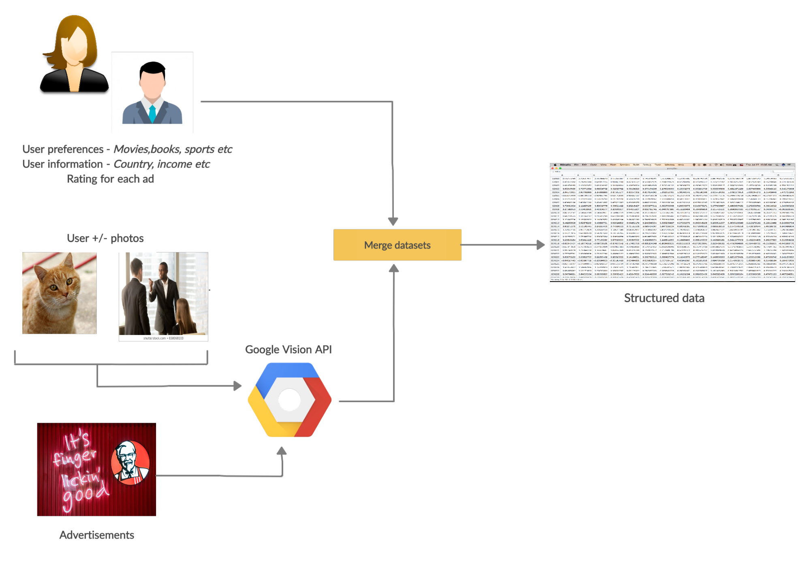

        Figure 1. Creating structured dataset by
combining information from resources in ADS-16 

Google vision API was used on Ad images to extract rich semantic
information from them. Several encoding techniques like multi label
binarizer, one-hot encoding and Glove embeddings are used to transform
categorical data into numbers. We experimented with multiple word
embeddings and picked the one which gave the best based AUC score. The
final encoded training data is available <a href="https://www.google.com/url?q=https://github.com/salilkanitkar/responsible_ai_hackathon/blob/master/dataset/users-ads-without-gcp-ratings_OHE_MLB_FAV_UNFAV_Merged.csv&amp;sa=D&amp;ust=1589252851993000" class="c15">here</a>.

### Model Architecture 

We then trained a neural network model using Keras Functional API as a
classification problem where the model is tasked to predict the rating
for a given User and Ad combination. The high level model architecture
is shown in Figure 2.

### 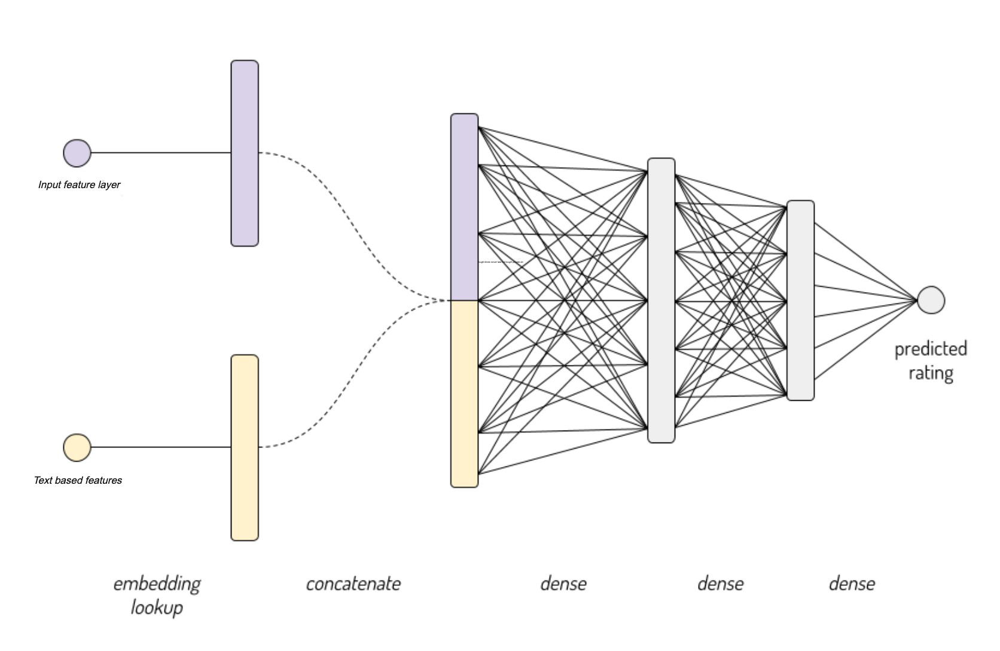

         Figure 2
Model architecture using Glove embeddings and
dense layers with 20 & 10 units

Source - <a href="https://www.google.com/url?q=https://www.kaggle.com/colinmorris/embedding-layers&amp;sa=D&amp;ust=1589252851994000" class="c15">https://www.kaggle.com/colinmorris/embedding-layers</a>

We experimented with various feature combinations and hyperparameters
(HP) to identify the best model with validation AUC. Tensorboard’s HP
Params dashboard’s parallel coordinates plot was quite helpful to narrow
down the best HP combination. The notebook with data preparation and
model training source code is available <a href="https://www.google.com/url?q=https://github.com/salilkanitkar/responsible_ai_hackathon/blob/master/models/basic-model/nn-model.ipynb&amp;sa=D&amp;ust=1589252851994000" class="c15">here</a>.
For others to be able to reproduce our results here are our <a href="https://www.google.com/url?q=https://docs.google.com/spreadsheets/d/1v-nYiDA3elM1UP9stkB42MK0bTbuLxYJE7qAYDP8FHw/edit%23gid%3D925421130&amp;sa=D&amp;ust=1589252851994000" class="c15">training notes</a> and
<a href="https://www.google.com/url?q=https://tensorboard.dev/experiment/fkAOs09DSOKc52nhOtO1XA/&amp;sa=D&amp;ust=1589252851995000" class="c15">tensoboard.dev links</a>.

Fairness Metrics
=========================================

Before we can start assessment of potential unfairness
and bias, we need some methodology to measure it. The selection and
weighting of metrics is solely dependent on domain and our perception of
bias in society. For example, for gender bias one would care about fair
representation of both genders while in case of crime prediction one
would care about low misrepresentation rate. The following are the
standard metrics followed in the industry which is what we have used to
evaluate our models,

### False Positive Rate (FPR)

The false positive rate is calculated as the ratio
between the number of negative events wrongly categorized as positive
(false positives) and the total number of actual negative
events 

For example, in study for to classify toxic comments,

FPR (Religion:Christainity) = 0.16 and FPR (Religion:Muslim)=0.80,
clearly shows a bias based on religion.

### Equal Opportunity Difference (EOD)

This metric is computed as the difference of true
positive rates between the unprivileged and the privileged groups. The
true positive rate is the ratio of true positives to the total number of
actual positives for a given group.

The ideal value is 0. A value of \< 0 implies higher benefit for the
privileged group and a value \> 0 implies higher benefit for the
unprivileged group.The definition of privileged and unprivileged depends
on hypotheses decided by domain experts.

### Average Odds Difference (AOD)

Computed as average difference of false positive
rate (false positives / negatives) and true positive rate (true
positives / positives) between unprivileged and privileged
groups.

The ideal value of this metric is 0. A value of \< 0
implies higher benefit for the privileged group and a value \> 0 implies
higher benefit for the unprivileged group. Fairness for this metric is
between -0.1 and 0.1

Bias Detection
=======================================

### Baseline Model results

As explained previously, we built a DNN Model using the
ADS16 dataset and analyzed how it performed across the Fairness Metrics
mentioned in the above section - the False Positive Rate (FPR), Equal
Opportunity Difference (EOD) and Average Odds Difference (AOD). These
provided us with two-fold advantages:

1.  We could see the bias and unfairness that our
    trained model showcased.
2.  We could attack these specific bias(es) with
    targeted mitigation strategies and evaluate if and how effective
    they are in reducing the bias. 

In this section, let’s take a look at how our Baseline
Model performed. In subsequent sections, we will explain the mitigation
strategies applied.

Across the entire dataset - which includes
Advertisements from 20 different categories, we found two dimensions -
the Gender and the Age showcasing bias in the trained model. At a glance
some of these biases across the 3 Fairness Metrics looked like
below:

-   False Positive Rate for Females was 60% higher than
    Males (0.164 vs 0.09)
-   Equal Opportunity Difference was found to be 0.019.
    A greater than zero value here indicates higher benefit for the
    unprivileged group - which in our experiment is Male.
-   The False Positive Rate for the Young age group
    (less than 20 years) is 50% higher as compared to the Middle age
    group (between 20 to 40). 0.204 for Young vs 0.134 for Middle
    Age.

However, a more stark unfairness begins to show if
instead of looking across all Advertisement categories, we zoom in and
focus on a couple of particular categories of Ads. 

-   Age Bias in serving Sports Ads

<!-- -->

-   For the purpose of our analysis, we divided users
    into 3 age buckets. Age less than 20 years as “Young”, age between
    20 to 40 as “Middle Aged” and greater than 40 years as “Old”.
-   Seen below side-by-side are the two graphs showing
    the number of samples in each bucket on the left and the False
    Positive Rate for all buckets on the right. High FPR for the Young
    bucket.

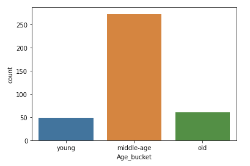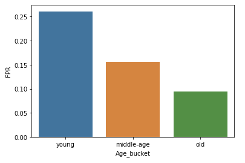

-   Looking at the Equal Opportunity Difference between
    Young-MiddleAges and Young-Old buckets (-0.19 vs -0.17), it's clear
    that Ads are served mostly to the younger age group as the value of
    EOD is more negative.
-   We will explain how we mitigated this in the Bias
    Mitigation Section below.

-   Gender Bias in Serving Consumer Electronics
    Ads

<!-- -->

-   We could also see a clear bias in serving Consumer
    Electronics Ads to Females and Males.
-   The EOD value is negative (-0.046) indicating that
    the bias is towards serving this to Male group.
-   The AOD value is more negative as well - indicating
    higher bias towards Male group. 
-   We explain how this was mitigated in the below section.

Bias Mitigation 
==================================================================

### Approaches to address concerns - Bias Mitigation approaches 

1.  Mitigation Approach 1 : Class balancing 

-   Oversampling : Synthetic Minority Oversampling
    TEchnique (<a href="https://www.google.com/url?q=https://imbalanced-learn.readthedocs.io/en/stable/generated/imblearn.over_sampling.SMOTE.html&amp;sa=D&amp;ust=1589252851999000" class="c15">SMOTE</a>)

Classification using class-imbalanced data is biased in
favor of the majority class. The bias is even larger for
high-dimensional data, where the number of variables greatly exceeds the
number of samples. SMOTE is a data augmentation technique using which
new samples can be synthesized from the existing samples. 

References : 

-   <a href="https://www.google.com/url?q=https://imbalanced-learn.readthedocs.io/en/stable/over_sampling.html%23cbhk2002&amp;sa=D&amp;ust=1589252852000000" class="c15">imblearn - oversampling</a>
    

1.  Mitigation Approach 2 : Reweighing 

-    Preprocessing optimization - Reweighing using <a href="https://www.google.com/url?q=https://aif360.mybluemix.net/&amp;sa=D&amp;ust=1589252852000000" class="c15">ai fairness 360</a> 

Reweighing is a preprocessing technique that Weights
the examples in each (group, label) combination differently to ensure
fairness before classification . This modifies the weight of each
training example depending on whether the sample lies in privileged or
unprivileged class . 

References  : 

-   <a href="https://www.google.com/url?q=https://link.springer.com/article/10.1007/s10115-011-0463-8&amp;sa=D&amp;ust=1589252852001000" class="c15">Data preprocessing techniques for classification without discrimination</a> 
-   <a href="https://www.google.com/url?q=https://arxiv.org/pdf/1810.01943.pdf&amp;sa=D&amp;ust=1589252852001000" class="c15">AI Fairness</a><a href="https://www.google.com/url?q=https://arxiv.org/pdf/1810.01943.pdf&amp;sa=D&amp;ust=1589252852002000" class="c15"> </a><a href="https://www.google.com/url?q=https://arxiv.org/pdf/1810.01943.pdf&amp;sa=D&amp;ust=1589252852002000" class="c15">360</a>
    

### Effect of Bias Mitigation steps

-       Age Bias in serving sports Ads

    We identified a bias in how the Sport Ads were
served to different age groups . 

    Age Groups :

        young : \< 20 yrs

        middleAged : 20 - 40 yrs

        old : \>40 yrs

     

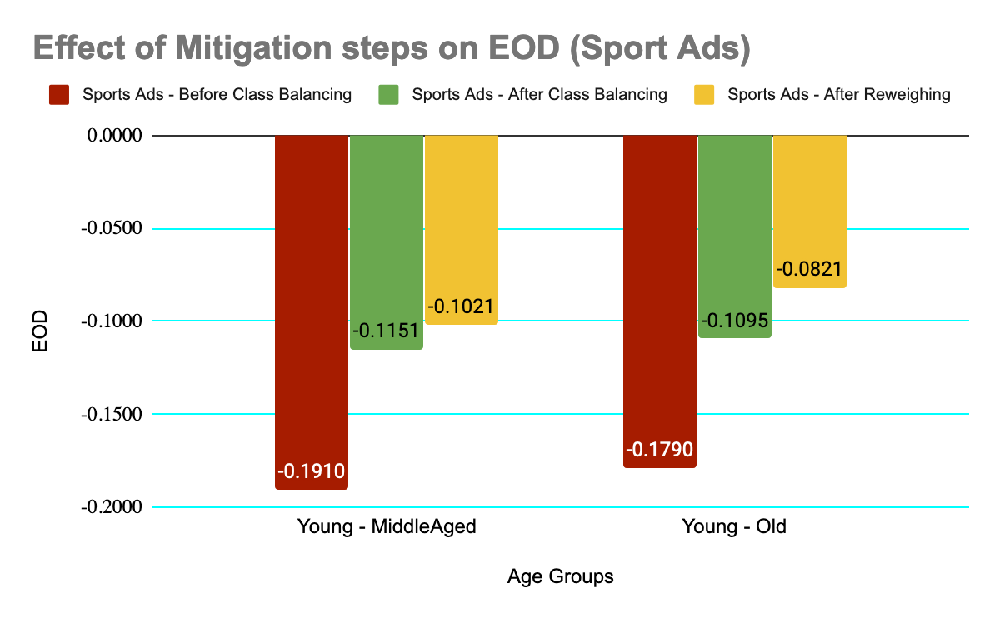

On Equal Opportunity Difference (EOD) comparison
between young-middleAged and young-old age groups . It's very clear that
Ads are served mostly to the younger age group as the values of EOD tend
to be more negative .  

By using the mitigation steps , we can see that the EOD
improves (closer to 0). Both class balancing and reweighing techniques
help with EOD . 

Even with Average Odds Difference (AOD) , we see that
before mitigation steps were added , the values are more negative
indicating a bias in serving these ads to the younger population . With
mitigation , we improve the AOD (closer to 0) . We found the class
balancing brought a higher improvement compared to reweighting . 

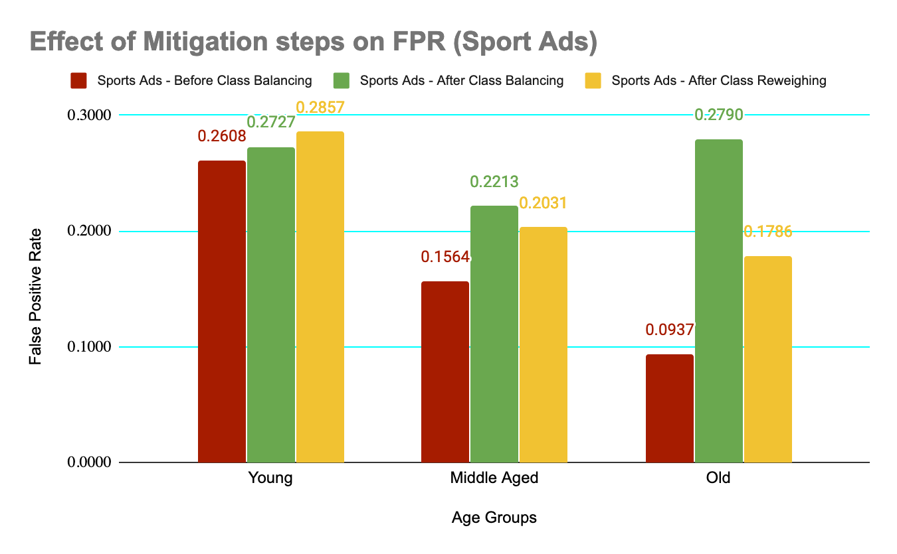

We also found that optimizing the model for fairness
increased the false positive rate. This is because adding these
mitigation steps diverts the objective of the model from only accuracy
to both accuracy and fairness.

-     Gender Bias in serving consumer
    electronics Ads

The other bias we identified was in the serving of
consumer electronics ads between male and female groups .

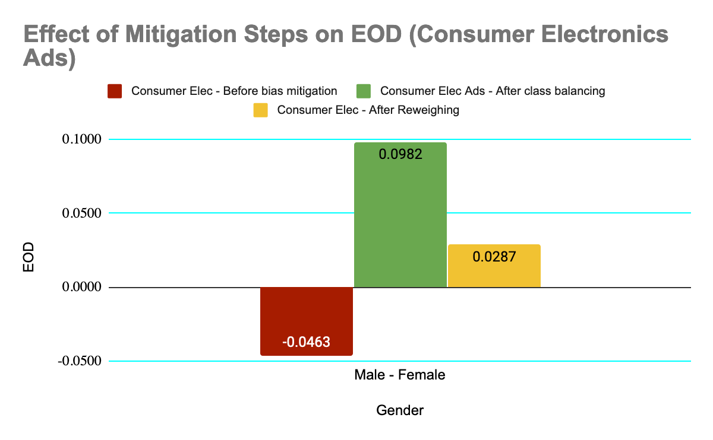

In the above chart we see that , before any mitigation steps , the EOD
is negative indicating that the bias is towards serving this to male
group . Both the mitigation steps try to eliminate this by moving EOD
closer to zero . We see that both the mitigation steps are aggressive
and push EOD to positive value makes the model more biased towards
females . Even though re-weighing makes it biased towards female group
,the model overall is less biased with it (0.0287 more closer to zero
compared to -0.0463)  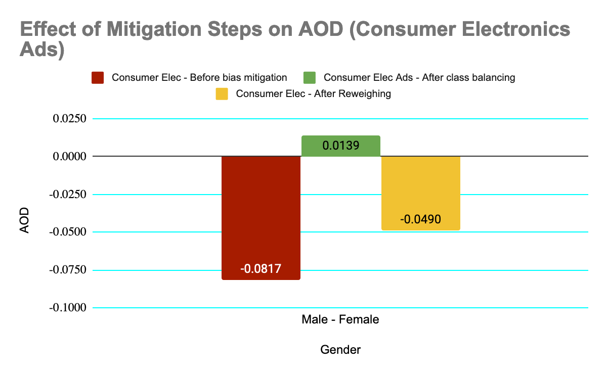

With AOD , we see that both the mitigation steps make
the model less biased . Even in this case class balancing is more
aggressive . 

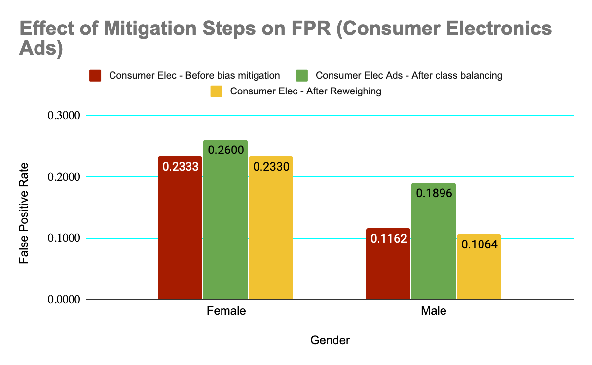

Like in the previous case (Sport Ads) , we see that the
false positive rate increases with the introduction of the bias
mitigation steps .

### Recommendation

In the above cases we see that class balancing using SMOTE and
reweighing are effective in making the model less biased .  It's also
important to be aware of the impact of adding bias mitigation steps on
the model metrics like accuracy , auc etc . These fairness strategies
might have a negative effect on accuracy and a proper trade off must be
made and this should be dependent on model objective .

Other explored Approaches
=================================================

#### Bias Metrics

-   <a href="https://www.google.com/url?q=https://arxiv.org/abs/1903.00780&amp;sa=D&amp;ust=1589252852006000" class="c15">Fairness through pairwise comparison</a> 

<!-- -->

-   This paper recommends a pairwise fairness metric
    and also a strategy to improve fairness using pairwise
    regularization for recommender systems . This strategy is shown to
    have significantly improved fairness and we believe the same could
    be explored for our use case too . 

#### Mitigation

-   Constrained Optimization

<!-- -->

-   The TensorFlow Constrained Optimization (TFCO) library (github repo
    <a href="https://www.google.com/url?q=https://github.com/google-research/tensorflow_constrained_optimization&amp;sa=D&amp;ust=1589252852007000" class="c15">here</a>) makes it easy to configure and train machine learning
    problems based on multiple different metrics (e.g. the precision on
    members of certain groups, the true positive rates on residents of
    certain countries etc).
-   Most of these metrics mentioned above are standard
    model evaluation metrics, however, TCFO offers the ability to
    minimize and constrain arbitrary combinations of them.
-   We explored two metrics offered by the TCFO library - the Equalized
    Odds and Predictive Parity (as referenced & defined <a href="https://www.google.com/url?q=https://ai.googleblog.com/2020/02/setting-fairness-goals-with-tensorflow.html&amp;sa=D&amp;ust=1589252852008000" class="c15">here</a>).

<!-- -->

-   Equalized Odds: For any
    particular label and attribute, a classifier predicts that label
    equally well for all values of that attribute.
-   Predictive Parity: A
    fairness metric that checks whether, for a given classifier, the
    precision rates are equivalent for subgroups under
    consideration.

<!-- -->

-   Even though we could not successfully use TCFO for
    mitigating the fairness concerns exposed by our base model, it did
    offer us an opportunity to assess a generalized optimizer
    library.

-   Debiasing word embeddings by adjust the directions of the word
    vectors as shared in <a href="https://www.google.com/url?q=https://www.coursera.org/lecture/nlp-sequence-models/debiasing-word-embeddings-zHASj&amp;sa=D&amp;ust=1589252852008000" class="c15">https://www.coursera.org/lecture/nlp-sequence-models/debiasing-word-embeddings-zHASj</a>

=========================

Challenges Faced
=========================================

-   Custom embeddings in feature columns: We wanted to
    take advantage of feature columns due to their close integration
    with many other TF tools, but were unable to as we wanted to use
    custom embedding not available on TF Hub.
-   Encoded CSV with TF fairness tools: We were unable
    to use TF fairness tools as the given examples use feature columns
    from raw CSV data. Instead we built our own using the ideas from
    Fairness Indicator APIs.
-   Non binary features fairness: Protected feature,
    Age for example had three values - young, middle age and old and
    current group fairness metrics like Equal Opportunity difference
    only work on 2 groups at a time. So we used our calculated best
    judgement based on false positives rates and compared various
    combinations two at a time.
-   Which fairness metric to use: Just like metrics for
    ML, we had to use our judgement based on the domain and use case to
    identify which fairness metrics are best suitable. We found equal
    opportunity score and average odds difference as relevant and easy
    to understand and hence used them.
-   Many possibilities of bias: We had 15 ad categories, 2 protected
    features and 2 mitigation plans which is 60 possible combinations to
    evaluate.

Suggestions to Tensorflow Tools<a href="#cmnt1" id="cmnt_ref1">[a]</a>
==========================================================================================================

Nam liber tempor cum soluta nobis eleifend option
congue nihil imperdiet doming id quod mazim placerat facer possim assum.
Typi non habent claritatem insitam; est usus legentis in iis qui facit
eorum claritatem. Investigationes demonstraverunt lectores legere me
lius quod ii legunt saepius.

=========================

Source Code
===================================

-   Github Repository for our code: <a href="https://www.google.com/url?q=https://github.com/salilkanitkar/responsible_ai_hackathon&amp;sa=D&amp;ust=1589252852010000" class="c15">https://github.com/salilkanitkar/responsible_ai_hackathon</a>
-   Training progress can be viewed on Tensorboard.dev at <a href="https://www.google.com/url?q=https://tensorboard.dev/experiment/fkAOs09DSOKc52nhOtO1XA/&amp;sa=D&amp;ust=1589252852011000" class="c15">https://tensorboard.dev/experiment/fkAOs09DSOKc52nhOtO1XA/</a> 
-   Fairness metrics dashboard <a href="https://www.google.com/url?q=https://github.com/Nithanaroy/recommender-ai-fairness-dashboard&amp;sa=D&amp;ust=1589252852011000" class="c15">https://github.com/Nithanaroy/recommender-ai-fairness-dashboard</a>

========================

References
==================================

\[1\] <a href="https://www.google.com/url?q=https://ai.googleblog.com/2020/02/setting-fairness-goals-with-tensorflow.html&amp;sa=D&amp;ust=1589252852012000" class="c15">Setting Fairness Goals with the TensorFlow Constrained Optimization Library</a> 

\[2\] <a href="https://www.google.com/url?q=https://github.com/google-research/tensorflow_constrained_optimization&amp;sa=D&amp;ust=1589252852012000" class="c15">google-research/tensorflow_constrained_optimization</a> has code samples on constrained optimization

\[3\] <a href="https://www.google.com/url?q=https://github.com/google-research/google-research/tree/master/pairwise_fairness&amp;sa=D&amp;ust=1589252852012000" class="c15">https://github.com/google-research/google-research/tree/master/pairwise_fairness</a> 

\[4\] <a href="https://www.google.com/url?q=https://github.com/tensorflow/fairness-indicators%23examples&amp;sa=D&amp;ust=1589252852013000" class="c15">https://github.com/tensorflow/fairness-indicators#examples</a>

Submission Questions
============================================

From <a href="https://www.google.com/url?q=https://devpost.com/submit-to/9668-tf-2-2-challenge-building-ai-responsibly/start/submissions/new&amp;sa=D&amp;ust=1589252852013000" class="c15">https://devpost.com/submit-to/9668-tf-2-2-challenge-building-ai-responsibly/start/submissions/new</a>

What's your project called?

Impact of user personality on advertisement
recommendations 

Here's the elevator pitch

What's your idea? This will be a short tagline
for the project. You can change this
later.

Marketing ads often misrepresent themselves and cater
to the audience in an unfair manner. We make sure our model exploring
the consumer's personality in recommending ads addresses this
concern.

It’s built with

What languages, APIs, hardware, hosts,
libraries, UI Kits or frameworks are you using? You can change this later.

Language - Python

Editor -
Jupyter notebook

Tools / libraries 

-   Development - Tensorflow, Keras, Pandas ,Numpy,
    sckit-learn
-   Visualization - seaborn, matplotlib, Tensorboard,
    
-   Fairness - Tensorflow, aif360, imblearn
-   Cloud services - Google Vision API
-   Dataset - <a href="https://www.google.com/url?q=https://www.kaggle.com/groffo/ads16-dataset&amp;sa=D&amp;ust=1589252852015000" class="c15">https://www.kaggle.com/groffo/ads16-dataset</a> 

Submission Guidelines
=============================================

Due: May 11, 2020

Build a functioning Tensorflow 2.2 based solution, and
tell us about how you leveraged the Responsible AI practices as you did
so. 

-   (Optional) Submit a 2-5 minute
    demo video hosted on YouTube, Vimeo, or
    Youku. Your video should include a demo of your working application,
    and any Responsible AI considerations and approaches.
-   Please submit at least one image or screenshot of
    your solution.
-   Please submit a PDF
    document discussing the Responsible AI
    concerns, any tooling you used, any approaches you took to address
    these concerns, and any challenges you faced in the process. If you
    have any requests from Tensorflow tools, let us know that as well!
     
-   Make sure all of your code has been uploaded to a
    public repo on GitHub or another public
    repository, and that a link to the repo has
    been included in your application.

All projects must be submitted by May 11th, 2020, at 11:45PM
Pacific Time. Judging will take place during Google I/O, from
May 11th through
May 15th. Contest
winners will be informed of their project's status on the evening of
May 19th.

\_\_\_\_\_\_

<a href="#cmnt_ref1" id="cmnt1">[a]</a>+nithanaroy@hotmail.com

\_Assigned to Nitin Pasumarthy\_
